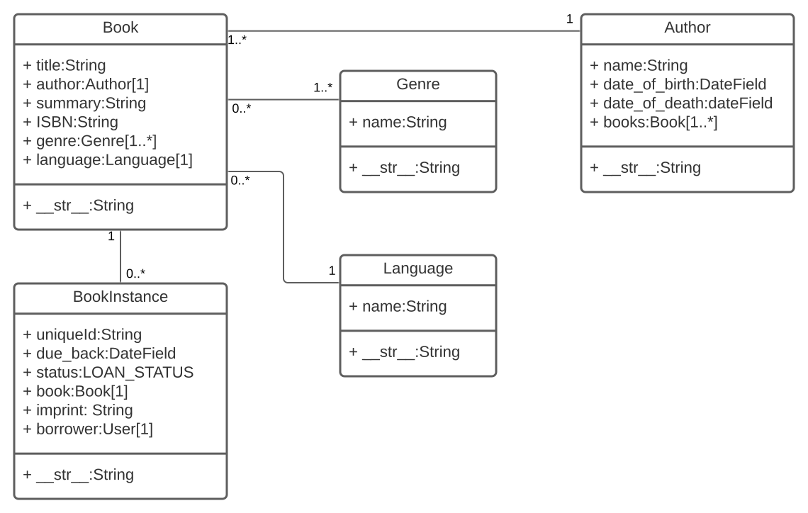

# Database UML

How to itereate on the collection

all_books = Book.objects.all()

Filter results
wild_books = Book.objects.filter(title__contains='wild')
number_wild_books = wild_books.count()

THe pattern is field + __ + contains/icontain/iexact/exact/in/gt/startswith

